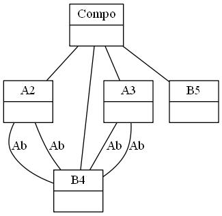
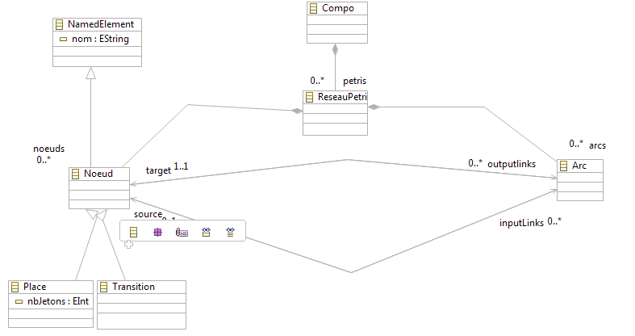
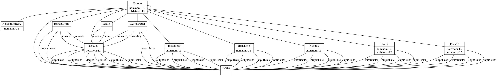
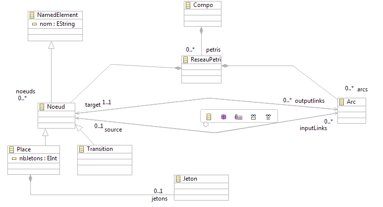
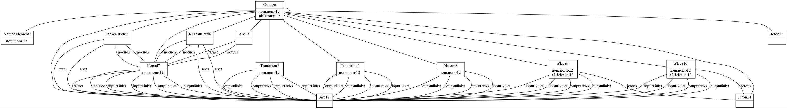
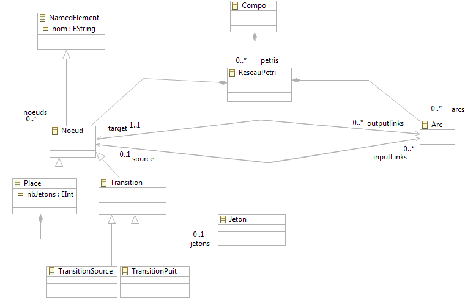
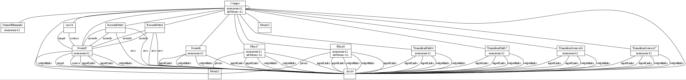

####Concevoir un méta-modèle conforme à ECore : utilisation du plugin Grimm pour générer un modèle conforme au méta-modèle ecore passé en paramètre.

------------------------------------------------------------

# Méta-Modèle d'un réseau de Petri: 

* EClass pour définir une classe   

* EAttribute pour définir un attribut d'une classe (un attribut est d'un type primitif entier, booléen, chaine...)  

* EReference pour définir une association entre 2 classes   

* EOperation pour définir une opération d'une classe   

* EParameter pour définir un paramètre d'opération   

## Définition de l'outil (plugin) Grimm:
Outil permettant de générer des models depuis des méta-modèles conforme Ecore.

###### Exemple d'utilisation : java -jar grimm.jar metamodel.ecore Compo root lb ub rb sys **

- grimm.jar : outil à utiliser pour générer le model : [téléchargment](http://www2.lirmm.fr/~ferdjoukh/english/research.html "téléchargment") 
- metamodel.ecore : le méta-modèle pour lequel vous voulez générer le modèle.
- Compo : le répertoire dans lequel sera stocké le modèle généré. _Vous pouvez visualiser l'instance du modèle généré en installant GraphViZ, le lien de téléachargemet_ [Download](http://www.graphviz.org/Download..php "title") 
- root : la classe racine du méta-modèle mm.
- lb : la borne inférieure du nombre d’instances par classe. Ex : 2
- ub : la borne supérieure du nombre d’instances par classe. Ex : 2
- rb : la borne supérieure du nombre d’instances par référence.  Ex : 4
- sym : Casser ou non les symmétries entre les variables des références : O ou 1.  Ex: 1

###### Exemple :  java -jar grimm.jar metamodel.ecore Compo 2 2 2 4 1

##### Remarques:

 - Il est impératif d'utiliser le même nom de répertoire, avec la première lettre en majuscule : Compo
 - Dans le méta-modèle que vous allez créer, veillez à rajouter la EClass Compo avec un association de composition vers la racine 
 	de votre modèle.
 - L'instance du modèle généré peut être exporter dans differents formats(pdf, png, jpg...etc).
 

## Premier exemple

Dans le répertoire model, vous trouverez un fichier .ecore sur lequel vous pourrez faire le premier test:
Le fichier généré ressemblerai à ceci:

  

#Méta-modèle 

### Version 1 du Méta-Modèle et l'instance du modèle généré:

  

------------------------------------------------------------

### Version 2 du Méta-Modèle et l'instance du modèle généré:

Après l'ajout d'une EClass Jeton et la l'agrégation entre la class "Place" et la class "Jeton".

------------------------------------------------------------

### Version 3 du Méta-Modèle et l'instance du modèle généré:

Après l'ajout d'une EClass Jeton et la l'agrégation entre la class "Place" et la class "Jeton".

------------------------------------------------------------

 
&copy; 2014 Houssam KOURDACHE